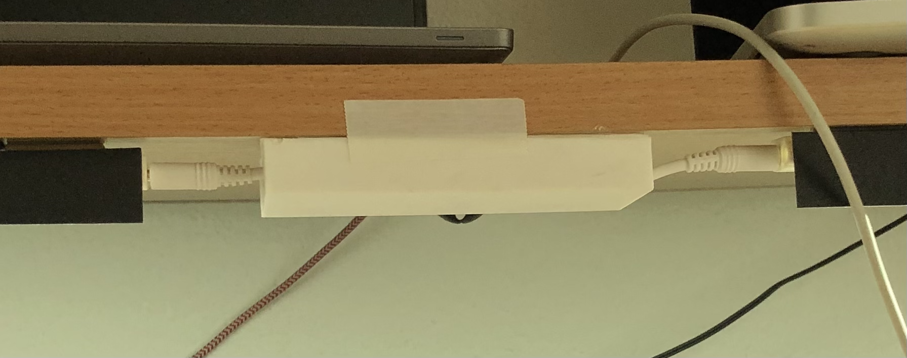
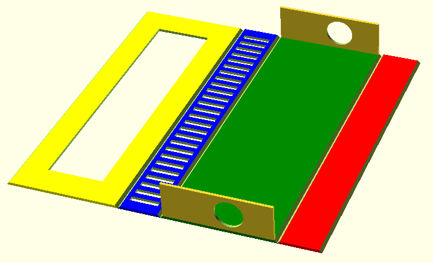

= Box hiding Wires

== Purpose

I have three led strips at the bottom of the shelf above my table.

The strips are connected to each other with a wire, which are way too long for my setup.
The first installation was just bringing the cable back towards the wall and back, hanging the power lines beneath the shelf.
It was ugly and I didn't like it.
I already have enough unordered and clumsy wires on my table.

Instead, I designed a box to hold the cable wrapped up.

== Design

NOTE: Colors helped me to identify the parts. It is only onscreen in OpenScad.

The box has thin walls, and it can be folded.
I designed the top to have a hole to save material, but later it became life-saving when I realized that I have to glue the box together before putting the cable in.

The round holes at the side are for the cable in and out.

The small venting holes in the back are to save material and design.
A passive power cable delivering limited power does not need cooling or venting at all.

The folded out design makes it possible to have a closed box without any supporting material.
Supporting material would be difficult to remove anyway.

video::I_tk-uoTgO8[youtube]

https://www.youtube.com/watch?v=I_tk-uoTgO8

NOTE: GitHub in my browser does not show the video file for some reason.

The video shows a time-lapse of the end of the printing (22sec).

== Result: failure and success

May be not a total failure.
Functionality wise it works.
On the other hand, the whole project was to provide some aesthetics.
The box is ugly.
And I had a lot of problem with fixing the box with the gluing.

I tried CA glue, hot gun and UV resin.
CA glue was working to put the box together, but the design does not give enough surface.
UV resin was a total failure.
I tried hot glue to fix the box to the bottom of the shelf.
It fell of in a few hours.
Finally, I used carpenter double-sided tape.
Still as you can see on the photo it is not perfect.

I may create an updated version with a better design.

The main learning though that the given dimensions the Creality PLA can be folded and gives enough strength.